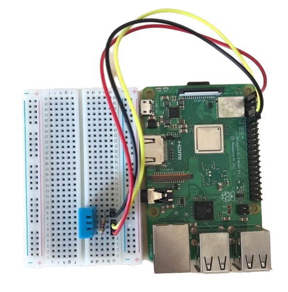
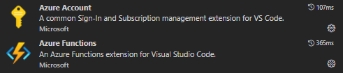
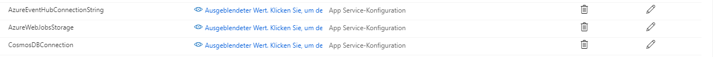
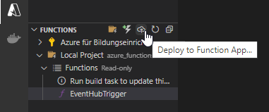

<h1 align="center">SmartGrowing</h1>

<p align="center">
  
  <br>
  <i>Serverless application monitoring plant growth affecting data using a Raspberry Pi and the Azure cloud.
  <br>
</p>

<br>
<hr>
<br>

## Preprequisites

- Raspberry pi, breadboard and dht11 sensor
- Python > 3.5
- Azure Account
- Azure Event Hub

<br>

## Getting started I - Raspberry Pi

Follow these steps to setup a Raspberry Pi which reads DHT11 sensor data and sends them to an Azure Event Hub.

<br>

On your Raspberry Pi run the following commands:

<br>

1. Install Python and DHT11-Toolkit.

   ```
   sudo apt-get update

   sudo apt-get install build-essential python3-dev

   git clone https://github.com/coding-world/Python_DHT.git

   cd Python_DHT

   sudo python3 setup.py install

   ```

2. Install Azure Event Hub package for python.

   ```
   pip3 install azure-eventhub

   pip3 install azure-eventhub-checkpointstoreblob-aio
   ```

3. Add the following lines to your /home/pi/.profile (right click -> show hidden files, if bash is your login shell as per default on raspbian) to establish os variables containing your Event Hub auth information. Replace `<your-connection-string>` and `<your-event-hub-name>` with your Azure Event Hub connection string and name under SAS (Shared Access Signature) in your azure account.

   ```
   EVENT_HUB_CONN_STR=Endpoint='<your-connection-string>'

   export EVENT_HUB_CONN_STR

   EVENT_HUB_NAME='<your-event-hub-name>'

   export EVENT_HUB_NAME
   ```

4. Connect DHT11 sensor.

   ```
   Plugin DHT11 sensor into breadboard.

   Connect 4.7 Ω resistor (yellow, purple, black, brown, gold) to pin 1 and 2 on the DHT11.

   Connect 3.3 V power supply (pin 1 on Raspberry Pi 3) to pin 1 on DHT11.

   Connect gpio 4 on Raspberry Pi (pin 7) to DHT11 pin 2.

   Connect ground (pin 9 on Raspberry Pi 3) to DHT11 pin 4.

   ```

   The setup should look like this.

   <br>
   

<br>

5. Create cron-job to execute smart_growing.py every minute.

   ```
   crontab -e

   Add * * * * * . $HOME/.profile; python3 /home/pi/<path-to-script>/smart_growing.py >> /home/pi/log.txt to end of file.

   Check out https://crontab.guru/ for examples on how to use cron.
   ```

<br>
Now you should be able to run the SmartGrowing/python_scripts/smart_growing.py script from this repository.

To set up an Event Hub continue to section II.

<br>

## Getting started II - Azure

<br>

1. Create a free Azure account.

<br>

2. Create an Azure Event Hub according to https://docs.microsoft.com/de-de/azure/event-hubs/event-hubs-create .

<br>

3. Create an Azure AD according to https://docs.microsoft.com/de-de/azure/active-directory/develop/quickstart-create-new-tenant .

<br>

4. Create an Azure Cosmos DB according to https://docs.microsoft.com/de-de/azure/cosmos-db/create-cosmosdb-resources-portal .

<br>

5. Azure Function

   <br>

   To run the Functions-App you will need Visual Studio Code and the following plugins for Azure.

   <br>
   
   <br>
   <br>

   Open the the folder SmartGrowing/azure_functions in Visual Studio Code.
   To debug local edit the local.settings.json and add the following information. Of course replace `<your-event-hub-connection-string>` and `<your-cosmos-db-connection-string>` with the accurate information from your azure account.

   <br>

   ```
   "AzureEventHubConnectionString": "<your-event-hub-connection-string>",

   "CosmosDBConnection": "<your-cosmos-db-connection-string>"
   ```

   To deploy the Functions-App to Azure you will need to add the same information in the config of your functions app (Azure portal) as seen in the following image.

   <br>

   

   <br>

   <br>

   To deploy the function to Azure just hit the cloud icon.

   <br>

   

<br>

## Getting started III - Xamarin.Forms

Open the Visual Studio solution in the folder SmartGrowing/xamarin_app and replace the values in SmartGrowing/xamarin_app/xamarin_app/Helpers/Constants.cs with your Azure information.
