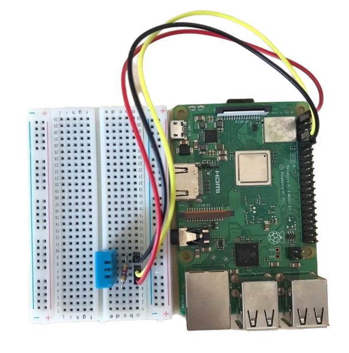

<h1 align="center">SmartGrowing</h1>

<p align="center">
  
  <br>
  <i>Serverless application monitoring plant growth affecting data using a Raspberry Pi and the Azure cloud.
  <br>
</p>

<br>
<hr>
<br>

## Preprequisites

- Raspberry pi, breadboard and dht11 sensor
- Python > 3.5
- Azure Account
- Azure Event Hub

<br>

## Getting started I - Raspberry Pi

Follow these steps to setup a Raspberry Pi which reads DHT11 sensor data and sends them to an Azure Event Hub.

<br>

On your Raspberry Pi run the following commands:

<br>

1. Install Python and DHT11-Toolkit.

   ```
   sudo apt-get install build-essential python3-dev

   git clone https://github.com/coding-world/Python_DHT.git

   cd Python_DHT

   sudo python3 setup.py install

   ```

2. Install Azure Event Hub package for python.

   ```
   pip3 install azure-eventhub

   ```

3. Replace connection string `CONNECTION_STR` and Azure Event Hub Name `EVENTHUB_NAME` with your Azure Event Hub connection string and name under SAS (Shared Access Signature) in your azure account.

   ```
   CONNECTION_STR = '<your-connection-string>'
   EVENTHUB_NAME = '<your-event-hub-name>'
   ```

4. Connect DHT11 sensor.

   ```
   Plugin DHT11 sensor into breadboard.

   Connect 4.7 Ω resistor to pin 1 and 2 on the DHT11.

   Connect 3.3 V power supply (pin 1 on Raspberry Pi 3) to pin 1 on DHT11.

   Connect pin 4 on Raspberry Pi to DHT11 pin 2.

   Connect ground (pin 4 on Raspberry Pi 3) to DHT11 pin 4.

   ```

   The setup should look like this.

   <br>
   

<br>

5. Create cron-job to execute smart_growing.py every minute.

   ```
   crontab -e

   Add ***** \<path-to-script>\smart_growing.py to end of file.

   Check out https://crontab.guru/ for examples on how to use cron.
   ```

<br>
Now you should be able to run the SmartGrowing/python_scripts/smart_growing.py script from this repository.

To set up an Event Hub continue to section II.

<br>

## Getting started II - Azure

<br>

## Getting started III - Xamarin.Forms
